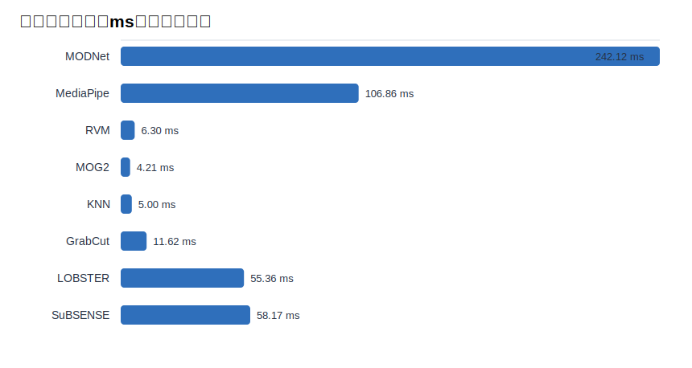
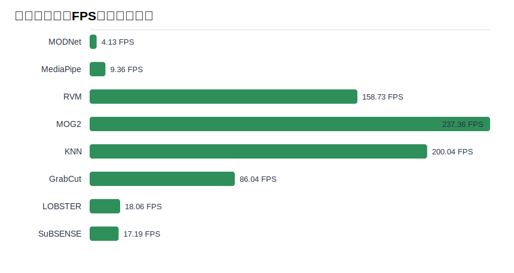
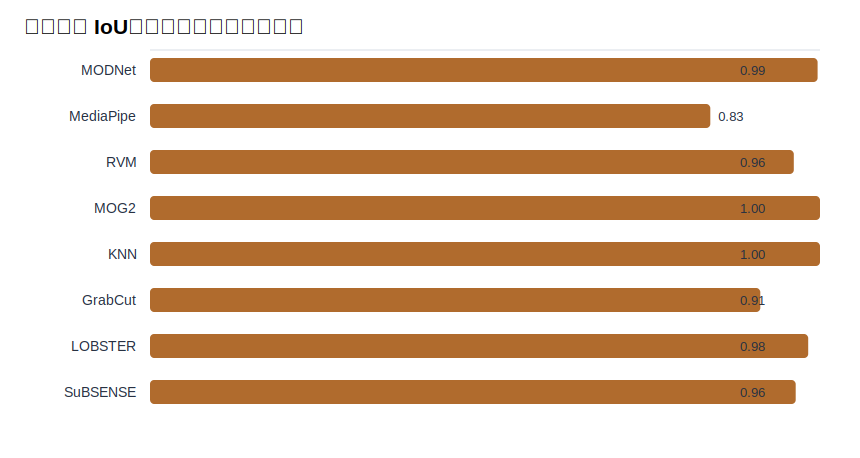
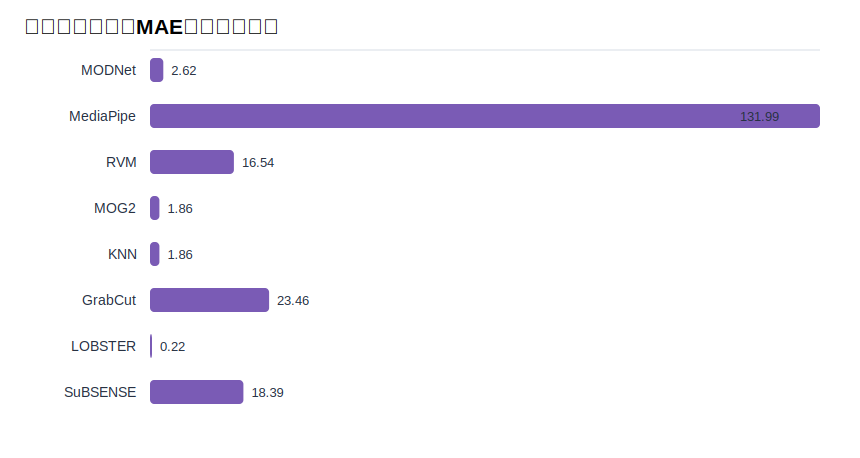

# 方法测试对比报告

生成时间：2026-05-08 15:49:28

## 结论摘要

- 项目源码当前注册了 **8 种方法**：3 种深度学习方法，5 种传统 CV 方法。
- 本机本次 **8 种方法全部完整运行**，深度依赖与模型权重均已就绪。
- 本次离线合成测试中，平均耗时最低的是 **MOG2**，约 **4.21 ms/帧**。
- 背景替换 IoU 最高的是 **MOG2**，约 **0.997**。

## 测试环境

- Python：3.14.4
- OpenCV：4.13.0
- NumPy：2.4.4
- torch：2.11.0
- torchvision：0.26.0
- MediaPipe：0.10.35
- onnxruntime：1.25.1
- 测试方式：离线合成帧，不依赖摄像头和 PPM-100 数据集
- 帧尺寸：320 x 240
- 预热帧：12
- 计时帧：30

## 项目方法清单

| ID | 方法 | 类型 | 实现文件 | 依赖/模型 | 本机状态 |
| --- | --- | --- | --- | --- | --- |
| 0 | MODNet | 深度学习 Matting | `algorithms/modnet/segmenter.py` | torch + torchvision<br>`models\modnet_photographic_portrait_matting.ckpt` | 完成 |
| 1 | MediaPipe | 深度学习 Segmentation | `algorithms/mediapipe/segmenter.py` | mediapipe<br>`models\selfie_multiclass_256x256.tflite` | 完成 |
| 2 | RVM | 深度学习 Video Matting | `algorithms/rvm/segmenter.py` | onnxruntime<br>`models\rvm_mobilenetv3_fp32.onnx` | 完成 |
| 3 | MOG2 | 传统 CV 背景建模 | `algorithms/cv_classic/segmenter.py` | opencv-python | 完成 |
| 4 | KNN | 传统 CV 背景建模 | `algorithms/cv_classic/segmenter.py` | opencv-python | 完成 |
| 5 | GrabCut | 传统 CV 交互式分割改造 | `algorithms/cv_classic/segmenter.py` | opencv-python | 完成 |
| 6 | LOBSTER | 传统 CV/LBSP 背景建模 | `algorithms/cv_classic/segmenter.py` | opencv-python + numpy | 完成 |
| 7 | SuBSENSE | 传统 CV/LBSP 自适应背景建模 | `algorithms/cv_classic/segmenter.py` | opencv-python + numpy | 完成 |

## 测试设计

本次测试生成固定的背景画面和移动的人像形状，先用空背景帧预热背景建模类方法，再用含前景的帧计时。输出结果通过“原图与处理结果的像素差”反推出被替换的背景区域，并与合成真值背景区域计算 IoU。

指标含义：

- 平均耗时 / FPS：衡量处理速度。
- 背景 IoU：衡量背景区域是否被正确替换，越高越好。
- 前景 MAE：衡量前景区域是否被误改，越低越好。
- 替换面积占比：输出中被替换为新背景的像素比例，可辅助判断是否过度替换或替换不足。

## 测试结果

| 方法 | 可测 | 初始化(ms) | 平均耗时(ms) | 中位耗时(ms) | FPS | 背景 IoU | 前景 MAE | 替换面积占比 |
| --- | --- | ---: | ---: | ---: | ---: | ---: | ---: | ---: |
| MODNet | 是 | 1879.61 | 242.12 | 227.59 | 4.13 | 0.993 | 2.62 | 0.839 |
| MediaPipe | 是 | 565.25 | 106.86 | 104.73 | 9.36 | 0.834 | 131.99 | 1.000 |
| RVM | 是 | 193.76 | 6.30 | 6.10 | 158.73 | 0.958 | 16.54 | 0.871 |
| MOG2 | 是 | 2.05 | 4.21 | 4.15 | 237.36 | 0.997 | 1.86 | 0.832 |
| KNN | 是 | 0.48 | 5.00 | 4.97 | 200.04 | 0.997 | 1.86 | 0.832 |
| GrabCut | 是 | 0.45 | 11.62 | 0.97 | 86.04 | 0.908 | 23.46 | 0.822 |
| LOBSTER | 是 | 0.50 | 55.36 | 54.90 | 18.06 | 0.979 | 0.22 | 0.816 |
| SuBSENSE | 是 | 0.56 | 58.17 | 58.40 | 17.19 | 0.961 | 18.39 | 0.868 |

## 图表









## 分析

深度学习方法（MODNet、MediaPipe、RVM）均已在当前环境中成功初始化并参与测试。在 CPU 环境下，MOG2 的单帧耗时最低，MOG2 的背景 IoU 最高；RVM 的吞吐量接近传统背景建模方法，更适合实时视频链路。MediaPipe 本次在合成形状上出现过度替换，说明它更依赖真实人像分布，合成基准只能作为工程烟测。

传统 CV 方法不依赖外部模型，适合做无模型环境下的实时替换和基线测试。背景建模类方法通常在固定摄像头、稳定光照、背景先被观察到的条件下表现更好；GrabCut 更偏静态图像分割，速度通常不如背景建模方法稳定。

## 复现命令

```bash
python scripts/evaluation/method_benchmark_report.py
```

原始 CSV 数据：`assets/method_benchmark_results.csv`
