# 直播场景模拟测试报告

生成时间：2026-05-08 16:47:33

## 结论摘要

- 测试数据模式：PPM-100 真实人像合成
- 参与对比方法：RVM, MODNet, KNN, MOG2, LOBSTER, SuBSENSE, GrabCut, MediaPipe
- 检测到 PPM-100 图像与 matte，因此本报告可扩展到深度学习方法。
- 真实人像 matte 数据源：PPM-100，来自 MODNet 作者公开数据集；本地下载自 Hugging Face 镜像并整理为 `data/PPM-100/image` 与 `data/PPM-100/matte`。
- 默认算法决策：RVM 在总体综合分和关键直播风险场景中均排名第一，当前上位机默认算法已切换为 **RVM**。
- 本轮直播模拟里，综合分最高的是 **RVM**（96.24）。MOG2 的综合分为 **90.46**，平均前景误替换率为 **5.61%**，背景漏替换率为 **14.31%**。 只看关键直播风险场景时，最高的是 **RVM**（96.39），MOG2 为 **83.05**；这说明静态/预热场景会掩盖 MOG2 在真实开播流程里的弱点。 MOG2 最弱场景是 **抖动光照压缩**，综合分 **80.55**；这类场景最接近用户开播时直接在镜头前、人物停留或摄像头自动调整造成的实时问题。

## 模拟办法

数据来源：

- PPM-100 官方仓库：https://github.com/ZHKKKe/PPM
- PPM-100 Hugging Face 镜像：https://huggingface.co/datasets/realdream-ai/ppm-matting

为了更接近真实直播，本脚本不再只测试静态空背景，而是生成连续视频流，并逐帧调用项目现有 `process_frame` 背景替换接口。每帧都有真值前景 mask，因此可以判断哪些背景应该被替换、哪些人物区域不应该被替换。

压力场景：

- **空背景预热后移动**：摄像头先看到空背景，再有人进入并持续小幅移动。
- **开播时人已在画面中**：没有空背景预热，真实直播中很常见，会考验背景建模算法是否把人学习成背景。
- **人物停住后再移动**：人物先移动、随后长时间停住、最后再次移动，测试前景被背景模型吸收的问题。
- **抖动光照压缩**：模拟摄像头自动曝光、轻微机位抖动、直播压缩和传感器噪声。

核心指标：

- 背景 IoU：预测被替换的背景区域与真值背景区域的交并比。
- 前景误替换率：人物区域中被替换成背景的比例，越低越好。
- 背景漏替换率：背景区域中没有被替换的比例，越低越好。
- 抖动率：相邻帧稳定背景区域中预测结果翻转的比例，越低越好。
- 综合分：`0.45 * 背景IoU + 0.35 * (1 - 前景误替换率) + 0.20 * (1 - 抖动率)`，换算为 0-100 分。

## 总体结果

| 方法 | 综合分 | 平均耗时(ms) | FPS | 背景 IoU | 前景误替换率 | 背景漏替换率 | 抖动率 |
| --- | ---: | ---: | ---: | ---: | ---: | ---: | ---: |
| RVM | 96.24 | 5.42 | 184.68 | 0.978 | 7.77% | 0.37% | 0.23% |
| MODNet | 92.38 | 314.70 | 3.18 | 0.961 | 16.61% | 0.43% | 0.25% |
| KNN | 90.46 | 5.06 | 203.95 | 0.818 | 2.09% | 17.74% | 3.07% |
| MOG2 | 90.46 | 3.99 | 254.18 | 0.845 | 5.61% | 14.31% | 3.01% |
| LOBSTER | 88.84 | 41.65 | 24.02 | 0.774 | 0.67% | 22.43% | 3.86% |
| SuBSENSE | 84.78 | 43.80 | 22.83 | 0.916 | 32.61% | 1.40% | 0.07% |
| GrabCut | 75.37 | 8.28 | 329.16 | 0.810 | 45.67% | 10.05% | 0.47% |
| MediaPipe | 69.98 | 105.28 | 9.50 | 0.859 | 67.63% | 0.09% | 0.01% |

## 分场景结果

| 方法 | 场景 | 综合分 | 耗时(ms) | 背景 IoU | 前景误替换率 | 背景漏替换率 | 抖动率 |
| --- | --- | ---: | ---: | ---: | ---: | ---: | ---: |
| MODNet | 空背景预热后移动 | 98.67 | 311.46 | 0.990 | 2.33% | 0.44% | 0.30% |
| MODNet | 开播时人已在画面中 | 98.74 | 332.77 | 0.990 | 2.16% | 0.47% | 0.31% |
| MODNet | 人物停住后再移动 | 98.72 | 307.78 | 0.990 | 2.24% | 0.51% | 0.14% |
| MODNet | 抖动光照压缩 | 73.38 | 306.81 | 0.874 | 59.72% | 0.29% | 0.26% |
| MediaPipe | 空背景预热后移动 | 70.09 | 104.94 | 0.859 | 67.37% | 0.10% | 0.00% |
| MediaPipe | 开播时人已在画面中 | 70.21 | 106.23 | 0.860 | 67.09% | 0.10% | 0.00% |
| MediaPipe | 人物停住后再移动 | 70.16 | 105.37 | 0.860 | 67.19% | 0.10% | 0.00% |
| MediaPipe | 抖动光照压缩 | 69.47 | 104.57 | 0.857 | 68.85% | 0.03% | 0.03% |
| RVM | 空背景预热后移动 | 96.46 | 5.46 | 0.980 | 7.37% | 0.28% | 0.24% |
| RVM | 开播时人已在画面中 | 96.23 | 5.31 | 0.979 | 7.93% | 0.25% | 0.20% |
| RVM | 人物停住后再移动 | 95.72 | 5.48 | 0.974 | 8.83% | 0.50% | 0.14% |
| RVM | 抖动光照压缩 | 96.56 | 5.41 | 0.979 | 6.95% | 0.45% | 0.34% |
| MOG2 | 空背景预热后移动 | 97.83 | 3.66 | 0.961 | 0.01% | 3.90% | 2.04% |
| MOG2 | 开播时人已在画面中 | 85.55 | 3.88 | 0.858 | 21.07% | 9.75% | 3.36% |
| MOG2 | 人物停住后再移动 | 97.89 | 3.60 | 0.957 | 0.01% | 4.27% | 0.92% |
| MOG2 | 抖动光照压缩 | 80.55 | 4.81 | 0.604 | 1.34% | 39.34% | 5.71% |
| KNN | 空背景预热后移动 | 98.34 | 4.26 | 0.976 | 0.89% | 2.22% | 1.26% |
| KNN | 开播时人已在画面中 | 89.82 | 4.84 | 0.832 | 5.91% | 15.51% | 2.69% |
| KNN | 人物停住后再移动 | 98.36 | 4.45 | 0.974 | 0.97% | 2.40% | 0.57% |
| KNN | 抖动光照压缩 | 75.30 | 6.69 | 0.490 | 0.61% | 50.84% | 7.73% |
| GrabCut | 空背景预热后移动 | 56.25 | 0.97 | 0.806 | 100.00% | 0.00% | 0.00% |
| GrabCut | 开播时人已在画面中 | 82.12 | 12.17 | 0.840 | 30.21% | 9.81% | 0.60% |
| GrabCut | 人物停住后再移动 | 81.77 | 10.28 | 0.838 | 31.05% | 9.92% | 0.34% |
| GrabCut | 抖动光照压缩 | 81.35 | 9.70 | 0.756 | 21.42% | 20.46% | 0.92% |
| LOBSTER | 空背景预热后移动 | 97.40 | 41.93 | 0.953 | 0.00% | 4.71% | 2.39% |
| LOBSTER | 开播时人已在画面中 | 92.71 | 42.58 | 0.865 | 2.69% | 12.98% | 1.32% |
| LOBSTER | 人物停住后再移动 | 97.66 | 40.49 | 0.953 | 0.00% | 4.73% | 1.07% |
| LOBSTER | 抖动光照压缩 | 67.57 | 41.61 | 0.327 | 0.00% | 67.32% | 10.65% |
| SuBSENSE | 空背景预热后移动 | 89.33 | 43.49 | 0.946 | 23.57% | 0.00% | 0.00% |
| SuBSENSE | 开播时人已在画面中 | 72.82 | 44.02 | 0.832 | 55.97% | 5.55% | 0.21% |
| SuBSENSE | 人物停住后再移动 | 88.90 | 43.29 | 0.944 | 24.53% | 0.00% | 0.00% |
| SuBSENSE | 抖动光照压缩 | 88.05 | 44.40 | 0.940 | 26.36% | 0.05% | 0.06% |

## 关键直播风险场景

这里单独汇总“开播时人已在画面中”和“抖动光照压缩”。这两类比空背景预热更接近真实直播，也是 MOG2 实际观感变差的主要来源。

| 方法 | 风险场景综合分 | 平均耗时(ms) | 背景 IoU | 前景误替换率 | 背景漏替换率 | 抖动率 |
| --- | ---: | ---: | ---: | ---: | ---: | ---: |
| RVM | 96.39 | 5.36 | 0.979 | 7.44% | 0.35% | 0.27% |
| MODNet | 86.06 | 319.79 | 0.932 | 30.94% | 0.38% | 0.29% |
| MOG2 | 83.05 | 4.35 | 0.731 | 11.21% | 24.54% | 4.54% |
| KNN | 82.56 | 5.77 | 0.661 | 3.26% | 33.17% | 5.21% |
| GrabCut | 81.73 | 10.94 | 0.798 | 25.82% | 15.14% | 0.76% |
| SuBSENSE | 80.44 | 44.21 | 0.886 | 41.17% | 2.80% | 0.14% |
| LOBSTER | 80.14 | 42.10 | 0.596 | 1.35% | 40.15% | 5.98% |
| MediaPipe | 69.84 | 105.40 | 0.859 | 67.97% | 0.07% | 0.02% |

## 图表

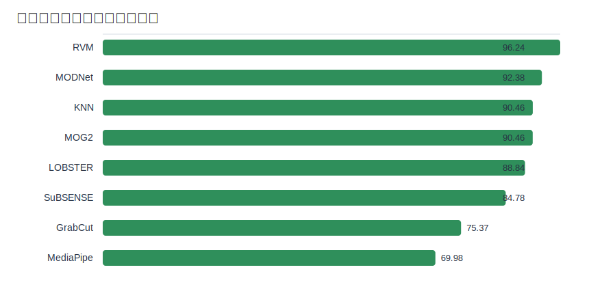

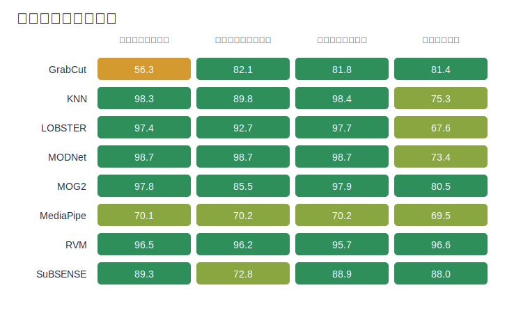

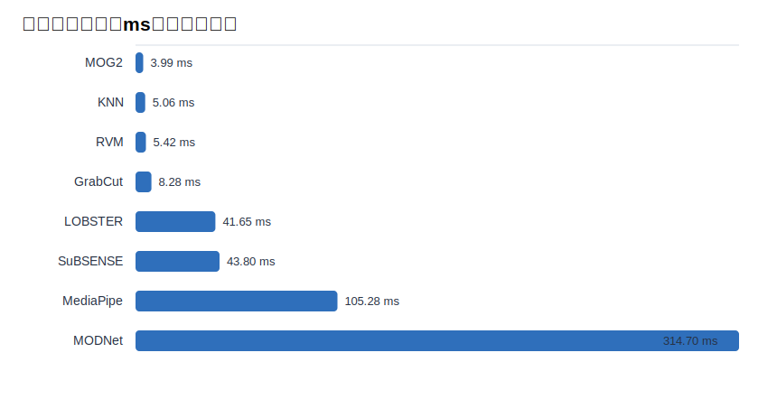

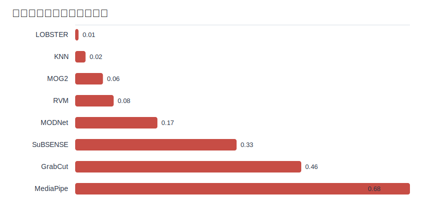

## 八种算法样例

红色表示人物被误替换，蓝色表示背景漏替换。

### RVM

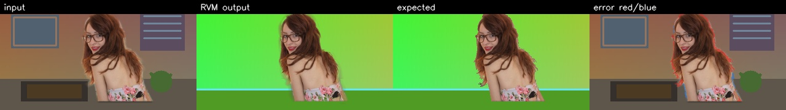
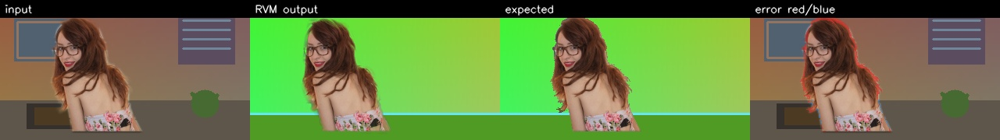
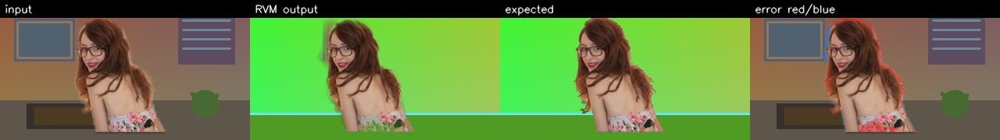
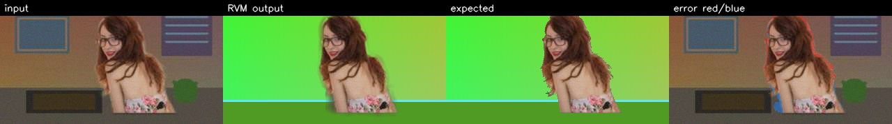

### MODNet

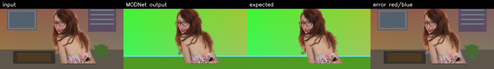
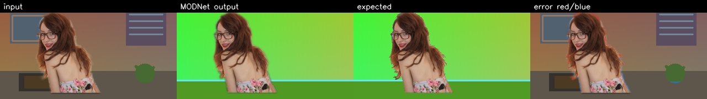

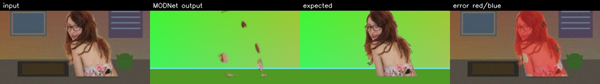

### KNN


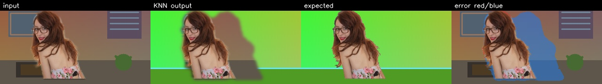
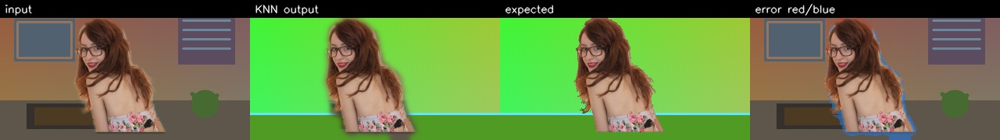
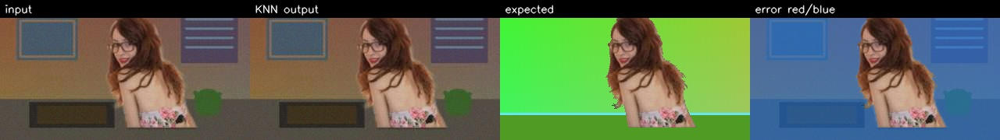

### MOG2


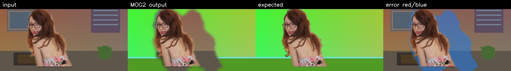
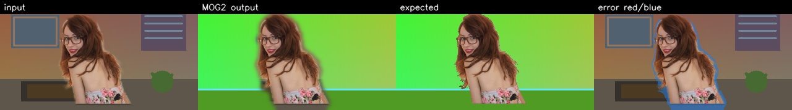
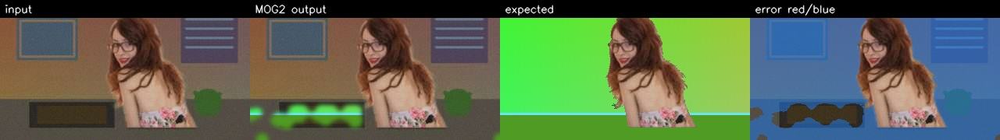

### LOBSTER

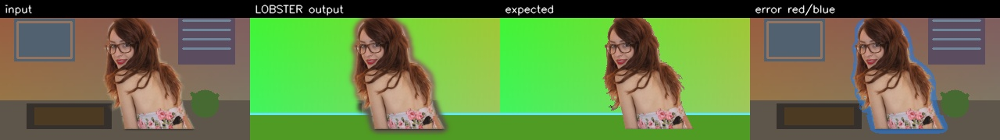
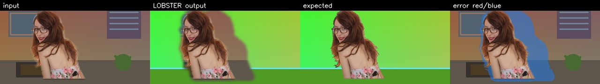
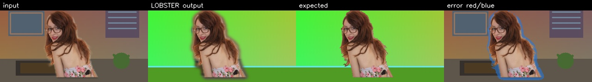
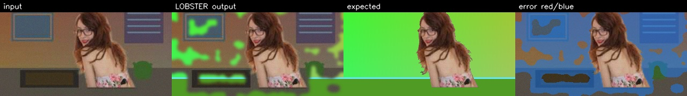

### SuBSENSE

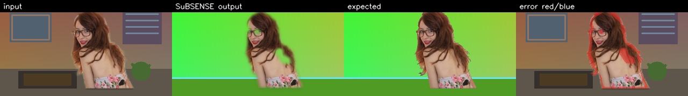
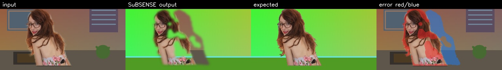
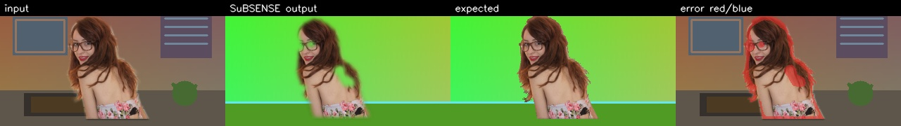
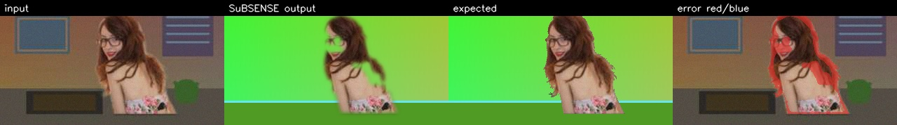

### GrabCut

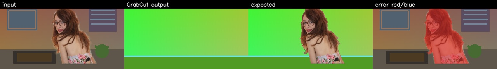
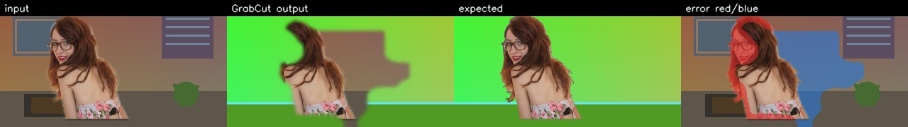
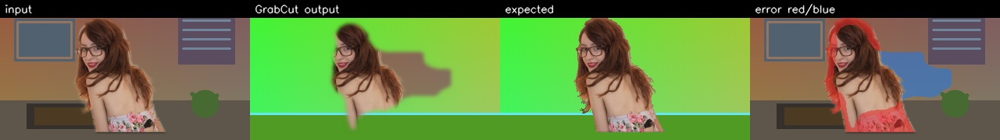
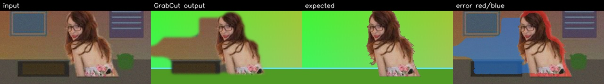

### MediaPipe

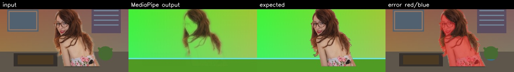
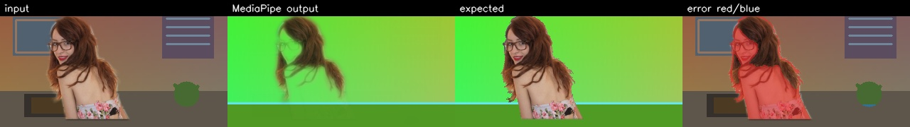
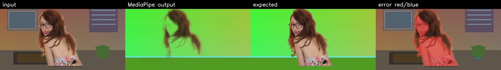
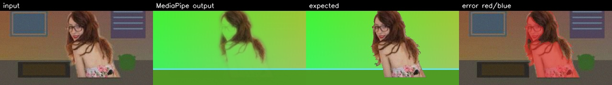

## 分析

MOG2 的根本假设是背景相对稳定，并且背景模型能先看到足够干净的背景。直播里常见的“人一开始就在镜头前”“人物停住说话”“摄像头自动曝光和轻微抖动”都会破坏这个假设。它可以作为无模型、固定机位、空背景预热充分时的低成本方案，但不适合作为默认直播抠像算法。

当前上位机默认算法已按本报告切换为 RVM。后续如果更新模型、摄像头采集链路或背景替换策略，建议重新运行本脚本，并继续优先选择“前景误替换率低、抖动率低、FPS 可接受”的方法。

## 复现命令

```powershell
.\.venv\Scripts\python.exe scripts\evaluation\live_stream_simulation_report.py
```

原始 CSV：`assets/live_stream_simulation_results.csv`
